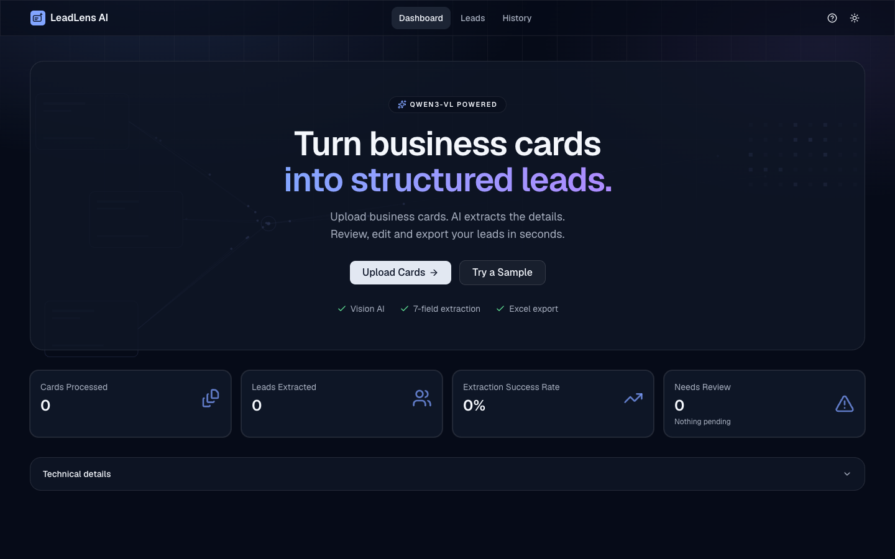
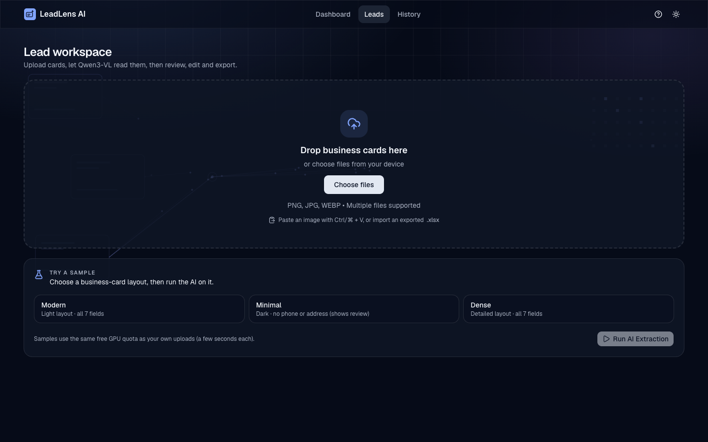
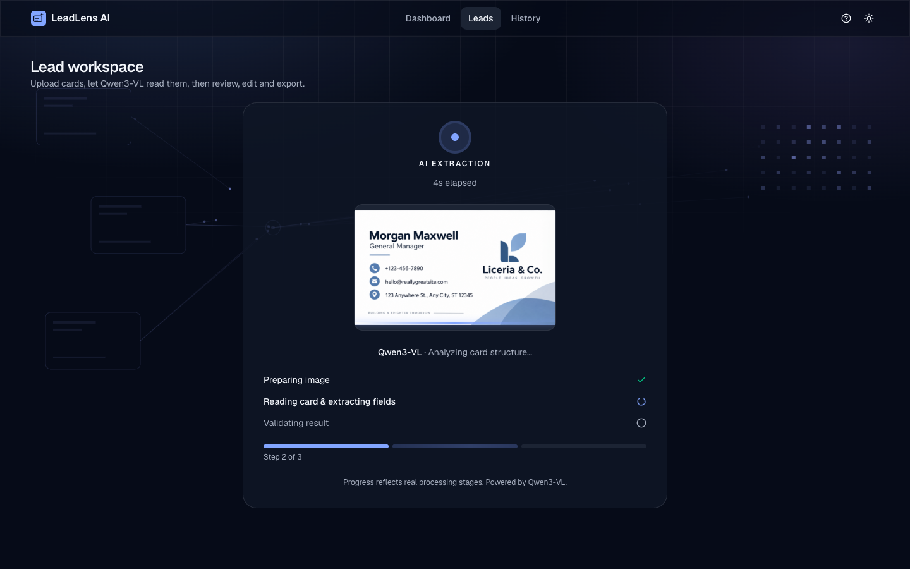
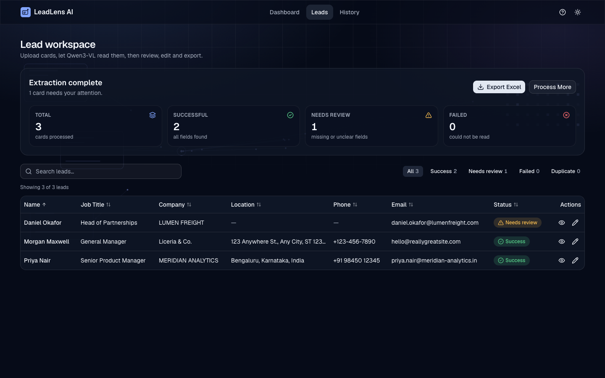
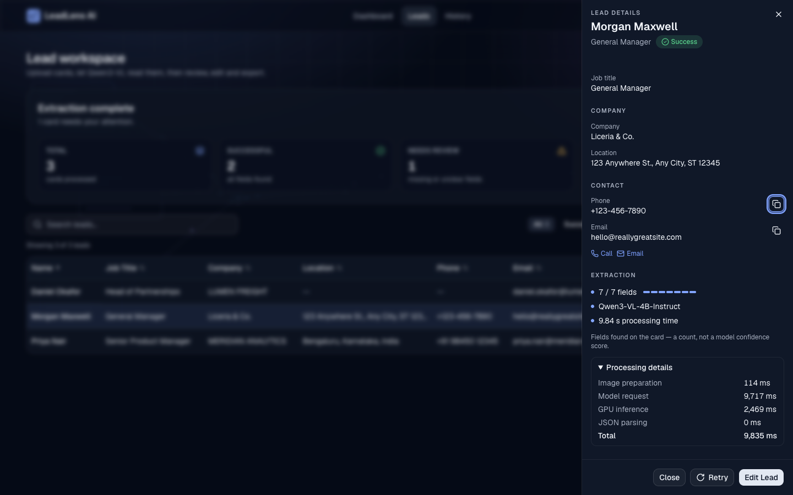
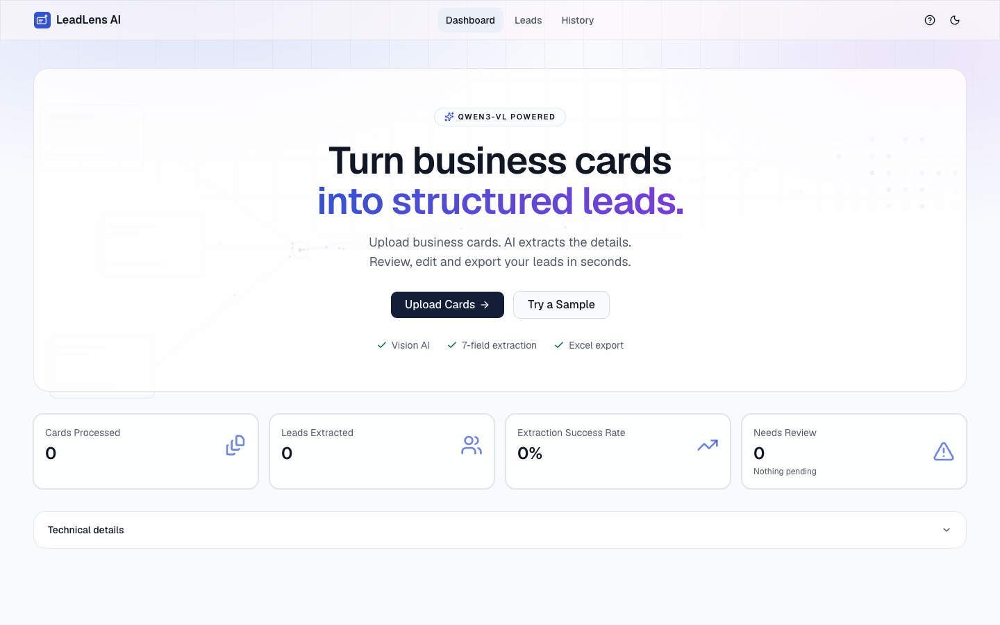
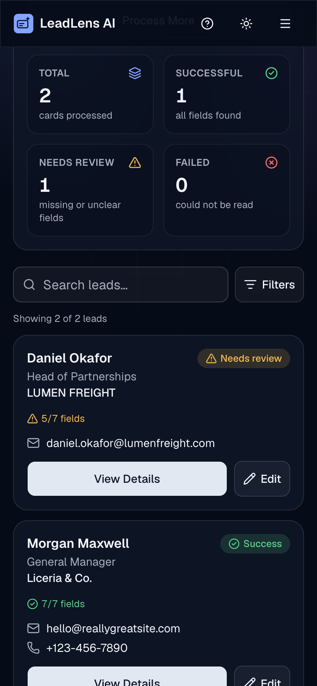
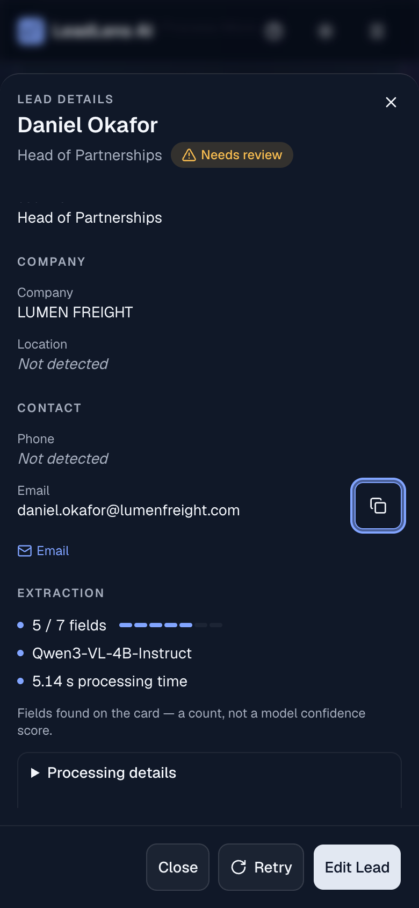
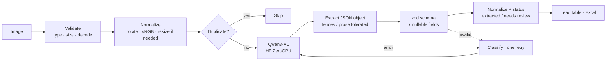

<div align="center">


# LeadLens AI

**Turn business cards into structured leads — with a vision-language model.**

Upload card images → **Qwen3-VL** reads them → review & edit → export to Excel.

[](https://leadlens-ai-three.vercel.app)
[](https://huggingface.co/Qwen/Qwen3-VL-4B-Instruct)
[](https://huggingface.co/spaces/prakhu23/leadlens-qwen3-vl)
[](https://leadlens-ai-three.vercel.app)
[](#testing--verification)



</div>

> **AWS was not used.** The assignment asked for Qwen on AWS or an equivalent
> environment. AWS deployment was not pursued during implementation (account
> payment/activation friction), and **nothing in this project runs on AWS**.
> Qwen3-VL inference is hosted on a **Hugging Face ZeroGPU Space**. Whether that is an
> "equivalent environment" is for the reviewer to judge. The inference layer sits behind
> a provider switch, so pointing it at an AWS/vLLM endpoint later needs only env vars —
> the AWS files in `docker/` and `docs/` are an **unexecuted design**.

## Contents

[Live demo](#live-demo) · [Screenshots](#screenshots) · [Features](#features) ·
[Architecture](#architecture) · [AI / VLM pipeline](#ai--vlm-pipeline) ·
[Qwen3-VL](#qwen3-vl) · [Image processing](#image-processing) ·
[JSON validation](#json-validation) · [Error handling](#error-handling) ·
[Excel export](#excel-export) · [Deployment](#deployment) · [Performance](#performance) ·
[Testing & verification](#testing--verification) · [Limitations](#limitations) ·
[Local setup](#local-setup) · [Environment variables](#environment-variables) ·
[AI usage](#ai-usage) · [Future improvements](#future-improvements)

## Live demo

| | |
| --- | --- |
| **App** | https://leadlens-ai-three.vercel.app |
| **Inference Space** | [`prakhu23/leadlens-qwen3-vl`](https://huggingface.co/spaces/prakhu23/leadlens-qwen3-vl) (Gradio, ZeroGPU) |
| **Source** | https://github.com/prakhau143/LeadLens-AI |

**Fastest way to try it:** open the app → **Leads** → click a **sample card** → **Extract
Leads**. No image needed.

> **Quota heads-up.** The free ZeroGPU tier gives roughly 5 GPU-minutes per account per
> day (2 for anonymous callers, per the
> [Hugging Face docs](https://huggingface.co/docs/hub/spaces-zerogpu)). A card uses
> about 3–4 GPU-seconds, so normal evaluation fits — but heavy repeated testing can
> exhaust it. When that happens the app says so plainly and the quota resets daily.

## Screenshots

<table>
  <tr>
    <td width="50%"><br/><sub><b>Upload</b> — drag & drop, or try a sample card</sub></td>
    <td width="50%"><br/><sub><b>Extraction</b> — stages reported by the server, not simulated</sub></td>
  </tr>
  <tr>
    <td width="50%"><br/><sub><b>Results</b> — search, filter, sort, status badges, Excel export</sub></td>
    <td width="50%"><br/><sub><b>Lead details</b> — source image, fields, model, timing</sub></td>
  </tr>
  <tr>
    <td width="50%"><br/><sub><b>Light theme</b> — theme persists across pages</sub></td>
    <td width="50%" align="center"><br/><sub><b>Phone</b> — lead cards instead of a shrunken table</sub></td>
  </tr>
  <tr>
    <td width="50%" align="center"><br/><sub><b>Phone drawer</b> — bottom sheet, 44 px targets</sub></td>
    <td width="50%"><br/><sub><b>Landing</b> — faint card → AI → data-grid backdrop (wide screens only)</sub></td>
  </tr>
</table>

All screenshots were captured from the **production deployment** with real Qwen output
(the sample cards in `public/samples/`).

## Features

- **Bulk upload** — drag & drop JPG / PNG / WEBP, up to 50 images per batch, plus built-in **sample cards**
- **Real progress** — per-card stages (*Preparing image → Reading card & extracting fields → Validating*) are emitted by the server as it enters them; nothing is simulated. One bad card never fails a batch
- **Structured extraction** — 7 fields per card: first name, last name, job title, company, location, phone, email. Anything not visible on the card comes back `null` — never guessed
- **Failed-card recovery** — "Extraction needs review" with **Retry**, **Edit manually** and **View image**
- **Lead drawer** — details view with source image, an *extraction completeness* count (fields found — **not** a model confidence score), model name and timing; then edit in place
- **Table tools** — search across all fields, status filters, sortable columns, sticky header, truncation with tooltips
- **Excel export & import** — exact 7 required columns plus a processing-summary sheet; an exported `.xlsx` can be dropped back into the upload zone to review and edit it again
- **History** — day-grouped batches, restorable and editable (browser-local)
- **Duplicate detection** — exact SHA-256 of the normalized image, within a batch
- **Sample picker** — choose *Modern*, *Minimal* or *Dense*, then **Run AI Extraction**: real model output, never canned data. Paste an image (Ctrl/⌘ + V) also works
- **Responsive** — table on tablet/desktop, **lead cards + filter sheet + bottom-sheet drawer** on phones, verified from 320 to 1920 px
- **Accessible** — keyboard navigation (skip link, arrow keys in the table, Esc closes panels), icon + text status badges, 44 px touch targets on touch devices, measured WCAG AA contrast, reduced-motion support
- **Design** — dark-first navy theme with a polished light mode, restrained glassmorphism, and a lightweight animated backdrop that is disabled on phones

## Architecture

```
                    ┌───────────────────┐
                    │      Browser      │
                    └─────────┬─────────┘
                              │  multipart upload / SSE progress
                              ▼
                    ┌───────────────────┐
                    │ Vercel / Next.js  │   validate · preprocess · dedupe
                    │  LeadLens app +   │   JSON extraction · zod validation
                    │  API routes       │   normalize · Excel export
                    └─────────┬─────────┘
                              │  server-side call (no credential in the browser)
                              ▼
                    ┌───────────────────┐
                    │ Hugging Face      │
                    │ Gradio · ZeroGPU  │
                    └─────────┬─────────┘
                              │
                              ▼
                    ┌───────────────────┐
                    │ Qwen3-VL-4B       │
                    │ Vision-Language   │
                    │ Model             │
                    └─────────┬─────────┘
                              │  raw model text
                              ▼
                     Structured JSON (validated in Next.js)
                              │
                              ▼
                    Lead review → Excel (.xlsx)
```

**AWS deployment was not used in the final deployment; Qwen3-VL inference is hosted on
Hugging Face ZeroGPU.**

The Space returns the **raw model text** (plus its own GPU time), nothing more. The Next.js server does all JSON extraction
and schema validation, so every provider passes the same checks and a bad reply becomes
a failed card — never a made-up lead.

There is no database and no job queue. A batch runs inside one request, three cards at
a time, and streams progress as Server-Sent Events. That fits the stated scale
(≤ 50 images) but not arbitrarily large batches.

### Provider switch

`src/lib/config/model.ts` picks where Qwen runs from env vars; the rest of the app does
not care which:

| Mode | Selected when | Notes |
| --- | --- | --- |
| **Self-hosted** (OpenAI-compatible) | `QWEN_BASE_URL` set | vLLM (intended AWS target, **never deployed**) or Ollama for local dev |
| **Hugging Face Space** | `HF_SPACE_ID` set | **What production uses.** `@gradio/client`, server-side only |
| **Vercel AI Gateway** | neither set | Hosted Qwen; fallback only. Not a self-deployed model |

### Tech stack

The brief describes React + FastAPI + Pydantic + AWS. This project is a **Next.js
monolith** instead: route handlers play the backend, `zod` plays Pydantic, `sharp`
plays Pillow, `exceljs` plays OpenPyXL. That is a deliberate substitution.

Next.js 16 (App Router) · React 19 · TypeScript · Tailwind v4 · shadcn/ui · Vercel AI SDK ·
`@gradio/client` · zod · sharp · ExcelJS · Vitest · Gradio + Transformers (Space).

## AI / VLM pipeline



The model is **not** asked for OCR text. It reads the card image directly — no OCR step,
no hand-written extraction rules.

## Qwen3-VL

- **Model:** `Qwen/Qwen3-VL-4B-Instruct` (Apache-2.0, ~4.4B parameters, image + text input), loaded in **bf16** in the Space
- **Space:** `hf-space/app.py` — a Gradio app with one endpoint, `/extract` (image + prompts → raw text + GPU time), decorated with `@spaces.GPU(duration=25)`, greedy decoding, `max_new_tokens=200`
- **Prompt:** `src/lib/prompts/extraction-prompt.ts`. Rules: extract only what is visible, never invent, `null` for missing fields, preserve phone/email exactly, no markdown or commentary. On the Space path the exact JSON key template is also appended — without it the model chose its own keys (`title`, `address`) and every card failed validation
- **Local development** uses Ollama's `qwen3-vl:4b`, a **quantized Q4_K_M** build — not identical to the bf16 weights, so local accuracy does not predict production accuracy

## Image processing

Server-side, before the model sees anything (`src/lib/services/image-service.ts`):

1. **Validate** — size limit and real format, sniffed from the bytes with `sharp` (the client's MIME type is not trusted)
2. **Decode** and **auto-rotate** using EXIF orientation, which also strips the metadata
3. **Convert to sRGB**
4. **Downscale only if the long edge exceeds 2000 px** — business-card text is small, so small images are never shrunk or enlarged
5. **Re-encode as JPEG (quality 90)** and hash for duplicate detection

The reference card (1654×951) passes through without resizing.

## JSON validation

`src/lib/utils/json-parser.ts` pulls the first balanced JSON object out of the reply,
then `zod` validates it against 7 nullable string fields (`src/lib/schemas/lead.ts`).

| Model reply | Result |
| --- | --- |
| clean JSON, padded JSON, ```` ```json ```` fenced JSON, JSON inside prose | recovered |
| truncated JSON, no JSON, wrong types (e.g. numeric phone) | rejected → one retry → `failed` |
| wrong key names | rejected (schema) — which is why the template is in the prompt |

The parser never "completes" or guesses missing content. Tested in
`tests/unit/json-parser.test.ts` and `tests/integration/malformed-output.test.ts`.

## Error handling

Failures are classified (`ExtractionError`) and shown to users in plain language; the
technical detail goes to server logs as JSON (Hugging Face tokens are redacted).

| Code | Meaning | Retried? |
| --- | --- | --- |
| `quota_exceeded` | Free ZeroGPU quota used up | no |
| `provider_unavailable` | Auth / billing / permission | no |
| `provider_unreachable` | Network failure reaching the model | once |
| `rate_limited` | Provider says slow down | once |
| `model_output` | Reply was not valid structured output | once |
| `unknown` | Anything else | once |

A failed card becomes a row that reads **"Extraction needs review"** with **Retry**,
**Edit manually** and **View image**. Retry re-runs just that card and swaps in the new
result. It needs the original image, so it works in the current session (not from
History). Invalid files fail on their own without stopping the batch.

## Excel export

`POST /api/export` → `.xlsx`.

- **`Leads` sheet** — exactly: *First Name, Last Name, Position / Job Title, Company, Location, Phone Number, Email Address*. One row per extracted or needs-review card; failed and duplicate cards are omitted; missing values are empty cells
- **`Processing Summary` sheet** — total, extracted, needs review, failed, duplicates, processed-at
- Cell text is written as strings, so a value like `=1+1` is never evaluated as a formula (tested)

### Excel import

Drop an exported `.xlsx` into the **Leads** upload zone (or use **Browse Files**) and it
opens as a finished batch — searchable, editable, re-exportable, saved to History.
`POST /api/import` (`src/lib/services/import-service.ts`):

- Reads the `Leads` sheet (or the first sheet), finds the header row within the first
  5 rows, and matches the 7 export headers case-insensitively (plus a few obvious
  spellings such as *Position*, *Phone*, *Email*)
- **Checks the bytes, not the name or MIME type** (an `.xlsx` is a zip); 5 MB and 1000-row limits
- Formulas are read as their **value, never their text**; rich text, hyperlinks and numbers
  are flattened to plain strings; blank rows are skipped
- **Status is recomputed** from the data (*needs review* if any field is missing or the
  email is malformed) — the file cannot claim a lead is "extracted"
- Only `.xlsx` is accepted; legacy `.xls` and CSV are rejected with a message saying so.
  An imported batch has no source images, so it offers Edit but not Retry / View image
- Round trip tested: a workbook from the app's own exporter imports back identically

## Design & accessibility

A dark-first "AI workspace" look: deep navy, blue/violet accent, restrained glass surfaces, and a light theme treated as a first-class design (soft blue-grey surfaces on off-white).

**Design tokens** (`src/app/globals.css`): background, foreground, muted, brand + brand-2 accent, border, `--success` / `--warning` / destructive, ring, and a `.glass-card` surface. Status is always **icon + text**, never colour alone.

**Contrast is measured, not eyeballed.** The OKLCH tokens were converted to sRGB and checked with the WCAG 2 ratio formula in both themes: every text/background pair passes AA (lowest **5.9 : 1** against the 4.5 : 1 requirement), and the focus ring clears 3 : 1.

**Background.** A small `<canvas>` (no Three.js, no assets, no new dependency) draws faint card outlines → an "AI node" → a dot-matrix, with ~24 particles moving between them at very low opacity. It is:
- **lazy-loaded** after the browser is idle, and only on screens ≥ 768 px without `prefers-reduced-motion` — phones and reduced-motion users get a static gradient + grid (CSS only) and never download the canvas code
- capped at **30 fps** and **stops drawing while the tab is hidden**
- `aria-hidden`, `pointer-events: none`, behind all content

Measured (Chrome, unminified dev build): about **2–3 % main-thread time** on desktop; **0 animation frames and 0.0 %** on phone width, with reduced motion, and while hidden.

**Responsive & touch.** Tested at 320, 360, 375, 390, 414, 768, 820, 1024, 1280, 1440 and 1920 px. On touch devices (`pointer: coarse`) buttons, inputs and summaries are at least 44 × 44 px; on all devices nothing is under WCAG 2.2's 24 px minimum.

**Keyboard & screen reader.** Skip link; visible focus rings; table rows are focusable (Enter opens, ↑/↓ move); sort headers are buttons with `aria-sort`; the drawer, help dialog and mobile menu are real dialogs with focus trapping and Esc to close; the mobile menu closes after navigation; form fields have labels and an `aria-invalid` email error; copy buttons announce "copied" politely.

## Deployment

| Piece | Where | How |
| --- | --- | --- |
| App + API | Vercel (production) | `vercel deploy --prod` from the CLI; **not** Git-connected, so pushes do not auto-deploy |
| Inference | Hugging Face Space `prakhu23/leadlens-qwen3-vl` | ZeroGPU hardware, Gradio SDK |
| Env vars (Vercel) | Production | `HF_SPACE_ID` only. No token is set |

**Deploying the Space** (`hf-space/`): create a Gradio Space with ZeroGPU hardware —
creating it with the default hardware fails with `402 Payment Required` (cpu-basic needs
PRO) — then upload the folder.

```python
import huggingface_hub as h
h.create_repo("<user>/leadlens-qwen3-vl", repo_type="space", space_sdk="gradio",
              space_hardware=h.SpaceHardware.ZERO_A10G, exist_ok=True)
h.HfApi().upload_folder(folder_path="hf-space", repo_id="<user>/leadlens-qwen3-vl", repo_type="space")
```

Then set `HF_SPACE_ID=<user>/leadlens-qwen3-vl` in the Vercel project.

**Docker** (`docker/`): a multi-stage, non-root image for the Next.js app. **AWS**
(`docs/AWS_DEPLOYMENT.md`, `docker/docker-compose.aws.yml`): a GPU-EC2 + vLLM design
that was **never executed** — it is documentation of a path not taken.

## Performance

Measured on the **production deployment**, 20 Sep 2026, from server-side timing logs
(`image_preparation_ms`, `model_request_ms`, `model_inference_ms`, `parsing_ms`,
`total_ms`). Cards ran three at a time.

| Stage | Observed |
| --- | --- |
| Image preparation | 62–125 ms |
| Model request (wall-clock, includes queue + transfer) | 5.8–9.7 s |
| **GPU inference** (inside the Space; what ZeroGPU bills) | **2.5–3.6 s** |
| JSON parsing | 0–3 ms |
| **End-to-end per card** | **5.9–9.8 s** |

> **This is a small sample, not a benchmark.** It is about a dozen production runs across the day,
> shown as ranges, not averages. A cold Space is slower (24–34 s was seen on a first
> call), and ZeroGPU queue time varies with load and remaining quota: in the slowest batch the GPU work was 2.5 s but the request took 9.7 s, the rest being queue and transfer.

What was done about latency: the Space model is loaded once at start-up (no per-request
initialisation), decoding is greedy with a 200-token cap, images are not resized unless
large, retries happen only for transient failures, and cards run with bounded concurrency
(3). The GPU reservation per call is 25 s: ZeroGPU checks the *requested* duration
against the remaining daily quota before running, and an earlier 60 s reservation was
rejected with 73 s left.

## Testing & verification

```bash
npm test          # vitest run — 91 tests in 16 files
npm run typecheck
npm run lint
npx tsc --noEmit
npm run build
```

Automated tests cover image validation/preprocessing, JSON recovery, schema and
normalization, Excel export and import (including a round trip), history grouping, the Space provider (mocked client), the
extract route (stage events, timings, one failed card not crashing a batch), and log
redaction. **No automated test calls a real model.**

**Verified live on 2026-09-20:**

| Claim | Evidence |
| --- | --- |
| Reference card extracts correctly | `tests/fixtures/morgan-maxwell-card.png`: all 7 fields matched the printed card in 4/4 command-line runs, and through the API and browser UI, locally and on production |
| 3-card batch on production | Two cards fully correct; the dark card returned phone/location as `null` (needs review). 9 real stage events streamed |
| Excel from production data | Records from the live API sent to the live `/api/export`; workbook re-read with `exceljs`: exact 7 headers, correct columns, blanks left blank |
| Excel import | A real export from production data was dropped into the upload zone in a browser: 3 leads, correct columns, statuses recomputed (2 extracted / 1 needs review), row opens in the drawer. A CSV and a text file renamed `.xlsx` were rejected with clear messages |
| Retry | Against a local fake model that failed 6 calls: failed row → Retry → extracted, summary updated |
| Responsive audit (UI polish round) | Dashboard, upload, results and History at **11 widths, 320 → 1920 px, on the live site**: 44/44 combinations with no horizontal overflow, no element outside the viewport, no control under 24 px, **0 under 44 px on touch**, and no console errors |
| Interactive states | Mobile menu (closes on Esc and after navigation), filter sheet, bottom-sheet drawer, edit form (invalid email blocks Save, valid saves), failed row → Retry, help dialog, keyboard navigation and skip link — all exercised in a real browser |
| Sample flow + batch + Excel on production | *Try a sample → Modern → Run AI Extraction* returned all 7 Morgan Maxwell fields (9.3 s end to end); a 3-card batch gave 2 successful / 1 needs review; an edit saved; the downloaded `.xlsx` had the exact 7 headers and the edited value |
| Contrast | All token pairs in both themes pass WCAG AA (measured with a script, see *Design & accessibility*) |
| Theme persistence | Dark and light survived refresh and navigation |
| No client-side secrets | Production JS bundles scanned for `hf_` tokens, `HF_TOKEN`, `NEXT_PUBLIC_` |

**Not verified — do not assume these work:**

- **Qwen on AWS** — never deployed (`docker/docker-compose.aws.yml` and the runbook were never run). vLLM specifics are untested
- **`HF_TOKEN`** — production runs anonymously. The docs say a token uses the account's quota instead of the anonymous pool, but this was not measured
- **Desktop Excel** — the `.xlsx` was validated by parsing, never opened in Excel
- **Docker** — the last successful image build predates the Space provider
- **Real photographs** — test cards are synthetic renders plus one designed reference card; accuracy on messy real photos is unmeasured
- **Browsers and devices** — all browser testing was **Chrome** (headless + device emulation). Safari, Firefox and real phones/tablets were not tested, and the touch-target results come from emulation
- **Real screen readers / real key presses** — row keyboard handling was verified with a dispatched event only

## Limitations

- **Free GPU quota** — about 5 GPU-minutes/day per account (less anonymously). The Space is public, so anyone can spend it. Not sized for production traffic
- **No authentication or rate limiting** — a public deployment lets anyone consume capacity
- **No database** — history lives in `localStorage` (last 20 batches, this browser only); source images are not stored, so History shows text without the photo and cannot Retry
- **One request per batch**, three cards at a time, capped by the function timeout (`maxDuration = 300`). Very large batches need a real queue
- **Import parses an untrusted zip in memory.** Size (5 MB) and row (1000) limits apply, but a crafted high-compression file is not defended against beyond that; the worst case is one failed serverless invocation
- **Duplicates are exact and in-batch only** — a re-photographed card or a later batch is not detected
- **Accuracy depends on the image and model** — handwriting, stylised fonts, glare, heavy rotation, multilingual cards and low resolution are unmeasured risks. The model is told to return `null` rather than guess, but a confident misread is possible
- **Progress percentage** is cards completed / total; per-card progress is shown as real stages because the model call has no progress signal
- **Dependency audit** — `npm audit` reports 2 moderate findings, both `uuid` inside `exceljs`. The advisory concerns `uuid` v3/v5/v6 with a caller-supplied buffer; `exceljs` only calls `v4`, so it is not reachable here. The suggested "fix" downgrades `exceljs` to a 2019 release and was not applied

## Local setup

```bash
git clone https://github.com/prakhau143/LeadLens-AI.git && cd LeadLens-AI
npm install
cp .env.example .env.local
```

Pick **one** model source in `.env.local`:

```bash
# A) Use the public Space (needs no token)
HF_SPACE_ID=prakhu23/leadlens-qwen3-vl

# B) Local Ollama — real inference on your machine (~3.3 GB download)
#    ollama pull qwen3-vl:4b
QWEN_BASE_URL=http://localhost:11434/v1
QWEN_MODEL=qwen3-vl:4b
```

```bash
npm run dev            # http://localhost:3000
```

Docker: `docker compose -f docker/docker-compose.yml up --build` (to reach Ollama on the
host, use `QWEN_BASE_URL=http://host.docker.internal:11434/v1`).

**API**

| Endpoint | Method | Description |
| --- | --- | --- |
| `/api/health` | GET | `{status, provider, model, timestamp}` — never exposes URLs or keys |
| `/api/extract` | POST | `multipart/form-data` (`files`, repeated). Streams SSE events (`card_started`, `card_stage`, `card_completed`, `card_failed`, `card_duplicate`) ending in one `done` event. `413` if too large, `400` for empty/oversized batches |
| `/api/export` | POST | JSON `{leads, summary}` (≤ 1000 leads) → `.xlsx` |
| `/api/import` | POST | `multipart/form-data` (`file`, one `.xlsx`, ≤ 5 MB, ≤ 1000 leads) → `{records, summary}`; `400` with a readable message for anything else |

**Project structure**

```
src/app/api/{health,extract,export}/route.ts   API routes
src/app/{page,leads,history}                   dashboard / upload + results / history
src/components/{layout,dashboard,upload,leads,ui}
src/hooks/use-extraction.ts                    upload state, SSE client, retry
src/lib/{config,schemas,services,prompts,utils}
hf-space/                                      Gradio app deployed as the Hugging Face Space
public/samples/                                sample business cards
docs/screenshots/                              README screenshots (from production)
docker/  docs/AWS_DEPLOYMENT.md                Docker files; AWS design (not executed)
tests/{unit,api,integration,fixtures}
```

## Environment variables

| Variable | Required | Notes |
| --- | --- | --- |
| `HF_SPACE_ID` | For Space mode | e.g. `prakhu23/leadlens-qwen3-vl`. Server-side only |
| `HF_TOKEN` | Optional | Server-side only, never `NEXT_PUBLIC_`; redacted from logs. Only needed for a private Space, or to charge a specific account's quota. **Not set in production.** A Read-role token is enough |
| `HF_SPACE_MODEL` | Optional | Display label only; the Space decides the real model |
| `QWEN_BASE_URL` | For self-hosted | OpenAI-compatible base URL |
| `QWEN_MODEL` | With `QWEN_BASE_URL` | e.g. `qwen3-vl:4b` (Ollama) / `Qwen/Qwen3-VL-4B-Instruct` (vLLM). No default — the app refuses to guess |
| `QWEN_API_KEY` | Optional | Required by the AWS compose (vLLM `--api-key`) |
| `SITE_ADDRESS` | AWS compose only | DNS name Caddy serves over HTTPS |
| `AI_GATEWAY_API_KEY` / `AI_GATEWAY_MODEL` | Fallback only | Used when neither of the above is set; needs a card on file |
| `MAX_UPLOAD_IMAGES` | No (50) | Enforced server-side |
| `MAX_IMAGE_SIZE_MB` | No (8) | Enforced server-side and via `Content-Length` before buffering |

`.env*` is git-ignored except `.env.example`. No secrets are committed.

## AI usage

Built with [Claude Code](https://claude.com/claude-code) (Claude Sonnet 5).

- **Used for:** architecture and stack proposal, model selection (checked against the live Hugging Face API rather than guessed), the extraction prompt and schema, the API/service layer, the UI, the tests, the Docker/AWS files, the Hugging Face Space, and this documentation
- **Adopted:** the pipeline (validate → preprocess → dedupe → extract → normalize → stream), SSE progress instead of job polling, client-side history instead of a database, and — when AWS proved impractical — a Hugging Face ZeroGPU Space behind an unchanged provider switch
- **Found and fixed by running things, not by inspection:**
  - The first README claimed a hosted gateway satisfied the "deploy Qwen" requirement. It does not; the claim was removed
  - The AI SDK did not repair fenced or prose-wrapped JSON as a comment claimed; a tested extractor was added
  - The Excel sheet had an extra `Status` column and blank rows for failed cards; both removed
  - Billing/auth failures were retried and shown as "try again"; they are now classified and reported honestly
  - Status and counts did not update after manual edits, and edits were not persisted to History
  - The Space path first failed every card: the model invented its own JSON keys because no schema reaches it. Fixed with an exact key template in the prompt
  - ZeroGPU rejected calls that reserved 60 s when little quota remained; the reservation is now 25 s, with a distinct `quota_exceeded` error instead of a misleading "billing issue"
  - Headless-Chrome mobile screenshots looked clipped at 390 px; it was a window-size artifact, and real device emulation showed no overflow
  - A first Retry test "succeeded" only because the AI SDK's own retries absorbed the simulated failures; the fake server was changed to fail long enough to produce a genuinely failed card
- **Author's statement:** *[Author: before submitting, confirm that you have personally reviewed and understand all generated code — this sentence can only be truthfully made by you. Generated code was tested as described in [Testing & verification](#testing--verification).]*

## Future improvements

- Deploy and validate the AWS/vLLM path so the assignment's deployment requirement is met literally
- Measure accuracy on real, messy card photographs
- Persist batches and images (Postgres + object storage) so History can Retry and show the photo
- Move extraction to a durable queue for large batches
- Perceptual hashing for near-duplicate cards
- Authentication and rate limiting before any wider sharing
- Configure `HF_TOKEN` on the server and measure whether it improves reliability
